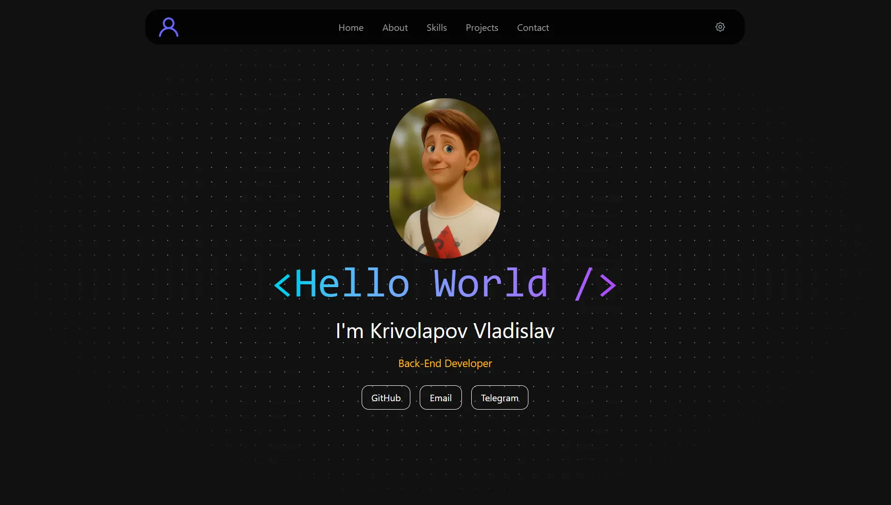
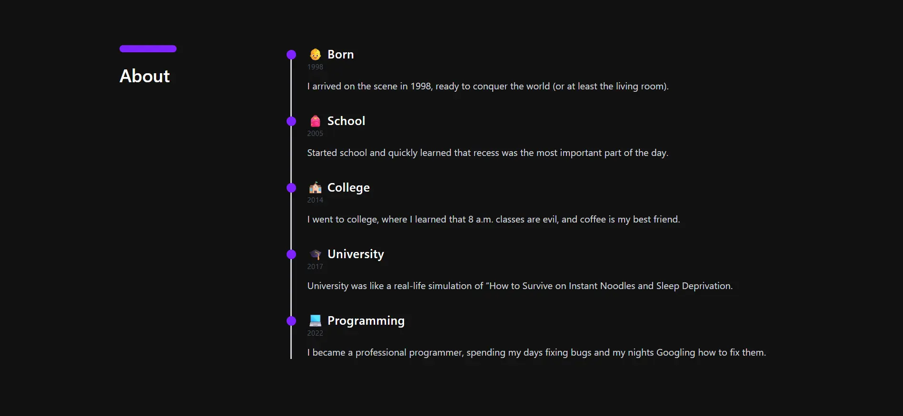
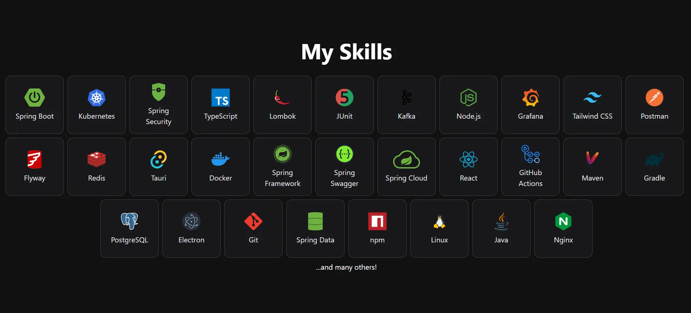
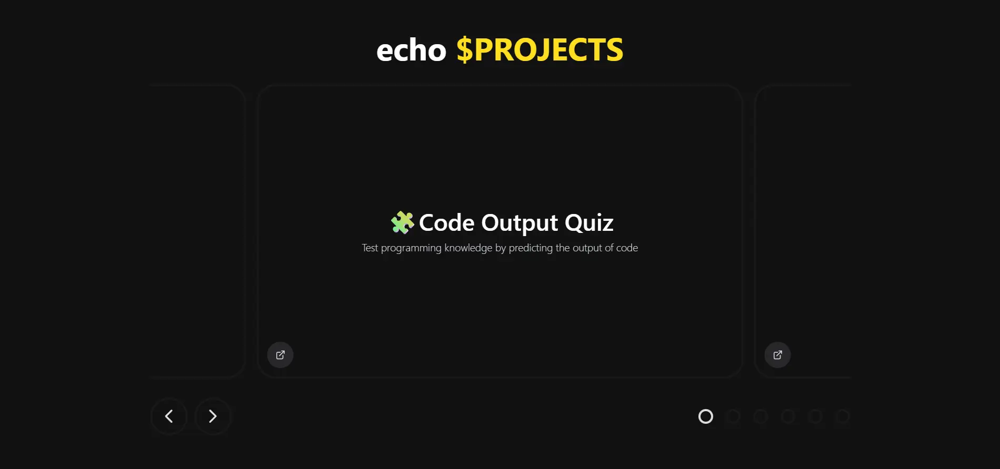
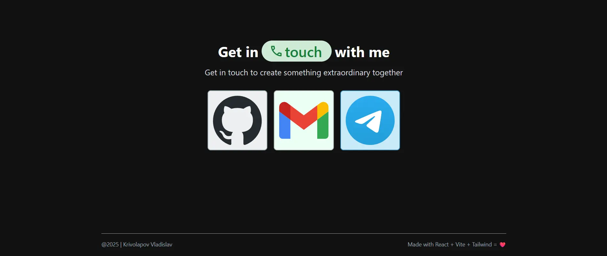

<div align="center">
   
   <h1>📘 Personal Site</h1>

[](https://github.com/krivolapovdev/krivolapovdev.github.io/blob/master/LICENSE)
[](https://github.com/krivolapovdev/krivolapovdev.github.io)
[](https://github.com/krivolapovdev/krivolapovdev.github.io/pulls)
[](https://github.com/krivolapovdev/krivolapovdev.github.io/issues)
[](https://github.com/krivolapovdev/krivolapovdev.github.io/graphs/commit-activity)

   <p>Made with ❤️</p>
</div>

## 🌐 Visit the Site

<div align="center">
  <a href="https://krivolapovva.ru/">
    
    
    
    
    
  </a>
</div>

## 🛠 Tech Stack

- **Frontend:** React + Vite
- **Styling:** Tailwind CSS
- **Deployment:** GitHub Pages
- **Additional Tools:** Biome, Lefthook, Motion

## 📦 Getting Started

To run the project locally:

```bash
git clone https://github.com/krivolapovdev/krivolapovdev.github.io
cd krivolapovdev.github.io
npm install
npm run dev
```

Then open your browser at http://localhost:5173

## 💌 Contact

- [**Email**](mailto:KrivolapovVladislav1998@gmail.com)
- [**Telegram**](https://t.me/krivolapovdev)
- [**Github**](https://github.com/krivolapovdev)

## ⚖️ License

This project is licensed under
the [MIT License](https://github.com/krivolapovdev/krivolapovdev.github.io/blob/main/LICENSE)
